<!-- Media Duplicate Finder README — features, installation, usage and dependencies -->
<p align="center">
  
</p>

<p align="center">
  
  
  
  
</p>

<br>

## ✨ Features

| Feature | Description | Power |
|---|---|---|
| 🖼️ **Image Duplicate Detection** | Uses **dHash** — catches resized, recompressed, and slightly modified dupes | Smart Matching |
| 🎬 **Video Duplicate Detection** | **xxHash64** engine — ultra-fast binary comparison, finds exact copies | Lightning Fast |
| 🎵 **Audio Duplicate Detection** | Same xxHash64 engine — detects duplicate MP3, FLAC, WAV, AAC, OGG & more | All Formats |
| 📁 **Deep Folder Scan** | Recursively walks all subfolders — no depth limit, no file left behind | 100% Coverage |
| ⚡ **Parallel Processing** | Groups files by size first, then hashes across all CPU cores simultaneously | Turbo Mode |
| 🎨 **Beautiful GUI** | Modern dark navy header, stats cards, collapsible tree, hover effects | Eye Candy |
| 🗑️ **Two Delete Modes** | Safe: Recycle Bin → Permanent: Full wipe (with warning) | Your Choice |
| 📊 **Live Statistics** | Groups found, duplicate count, wasted space, files scanned in real-time | Data Driven |
| 🔄 **Auto Update Check** | Checks GitHub for new releases on startup, one-click download & install | Always Fresh |

<br>

## ⚡ Installation

<p align="center">
  
  
  
</p>

| Step | Command | Result |
|---|---|---|
| **1** | `git clone https://github.com/BYDofficial1/Duplicare-Media-Deleter.git` | 📥 Downloads the project |
| **2** | `pip install -r requirements.txt` | 📦 Installs all dependencies |
| **3** | `python duplicate_finder.py` | 🚀 App launches! |

### What gets installed

| Package | Purpose | Why |
|---|---|---|
| 🖼️ `Pillow` | Image loading & processing for perceptual hashing | Required |
| 🧠 `imagehash` | dHash algorithm — finds visually similar images | Required |
| ⚡ `xxhash` | Ultra-fast 64-bit binary hash for video & audio | Required |
| 🗑️ `send2trash` | Safe deletion — moves files to Recycle Bin | Recommended |

<br>

## 🚀 How to Use

<table align="center">
  <tr>
    <td align="center" width="180"><b>📂  STEP 1</b><br><sub>Browse &amp; Select</sub><br><sup>Pick any folder</sup></td>
    <td align="center" width="60"><b>→</b></td>
    <td align="center" width="180"><b>🔍  STEP 2</b><br><sub>Scan for Dupes</sub><br><sup>Auto-detects all</sup></td>
    <td align="center" width="60"><b>→</b></td>
    <td align="center" width="180"><b>✅  STEP 3</b><br><sub>Select &amp; Delete</sub><br><sup>Safe or Permanent</sup></td>
  </tr>
</table>

| Action | What Happens |
|---|---|
| **Browse** | Select any folder |
| **Scan Now** | Tool scans all subfolders recursively |
| **Review Results** | View duplicates in collapsible groups |
| **Select Dupes** | Auto-select all duplicates (keeps originals) |
| **Delete** | Choose Safe (Recycle Bin) or Permanent |

<br>

## 📁 Supported File Types

| Category | Extensions | Count |
|---|---|---|
| 🖼️ **Images** | `.jpg` `.jpeg` `.png` `.gif` `.bmp` `.webp` `.tiff` `.tif` `.ico` `.svg` | **10 formats** |
| 🎬 **Videos** | `.mp4` `.avi` `.mkv` `.mov` `.wmv` `.webm` `.flv` `.m4v` | **8 formats** |
| 🎵 **Audio** | `.mp3` `.wav` `.flac` `.aac` `.ogg` `.m4a` `.wma` | **7 formats** |

<br>

## ⚙️ How It Works

<p align="center">
  
</p>

<br>

## 🧪 Testing

| Test Case | Result | Notes |
|---|---|---|
| Identical images, different filenames | ✅ Detected | dHash matches content, not names |
| Different images, same file size | ✅ Not flagged | Perceptual hash sees the difference |
| Nested subfolders (10+ levels deep) | ✅ 100% Coverage | Recursive scan walks all depths |
| Mixed file types (txt, pdf, media) | ✅ Only media processed | Non-media files are ignored |
| Large files (4GB+ video) | ✅ Handled | xxHash64 streams in chunks |
| Corrupted images | ✅ Gracefully skipped | Try/except catches errors |

<br>

## 📦 Dependencies

```
Pillow>=10.0.0       🖼️ Image processing
imagehash>=4.3.0     🧠 Perceptual hashing (dHash)
xxhash>=3.0.0        ⚡ Ultra-fast binary hashing
send2trash>=1.8.0    🗑️ Safe Recycle Bin deletion
```

> All packages are lightweight, cross-platform, and open-source.

<br>

<p align="center">
  
</p>
 
